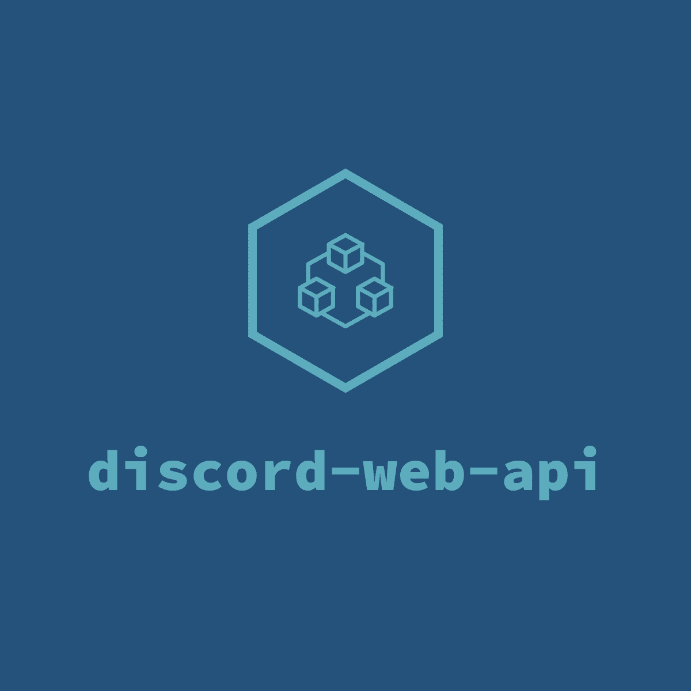

 

# :sparkles: discord-web-api

> **discord-web-api** Is a open source api to get basic information about any person or user in the discord simply by the id, You can also get guild information also via id.

> :warning: Note if you need to obtain information about which guild you need. The bot should be in the same community unlike to fetching information about the user.

# :interrobang: What are the advantages of API

**From here you can add very nice touches to your site or application, for example in the attached picture below. This is a special site of my bot, and in the information page for developers, I used this api to fetch information about the developers name, avatar, etc. ... and the code also found at the bottom. The code used in the explanation is just an example of what you can take advantage of the api, and this of course you can do to fetch information about a specific guild.**

## Image from the site:

 

## Code image:

 

* This code is created by **LWJerri#3290** github url: https://github.com/LWJerri.

# how to install

1. Clone this repository with `git clone https://github.com/Hadi-Koubeissi/discord-web-api.git`.
2. run im the cmd `npm i`.
3. add file name `.env` and add this in him without "".
`TOKEN="YOUR TOKEN HERE"`
`PORT="8080"`

# License

 **discord-web-api is licensed under the MIT license. See the file LICENSE for more information. If you plan to use any part of this source code in your own bot, I would be grateful if you would include some form of credit somewhere.**

# In the end:
 If you want to update anything in the `repository`, especially the Readme :) You can create a `Pull request` and if it is good, I will accept it immediately. And if you want `any help`, do not hesitate to contact me via the discord: `!      HaDi KouBeIssI | 🇱🇧#6256`